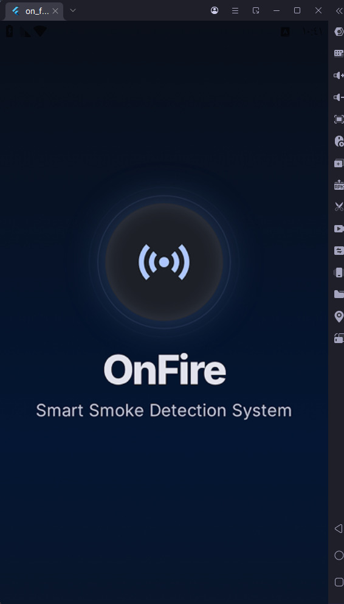
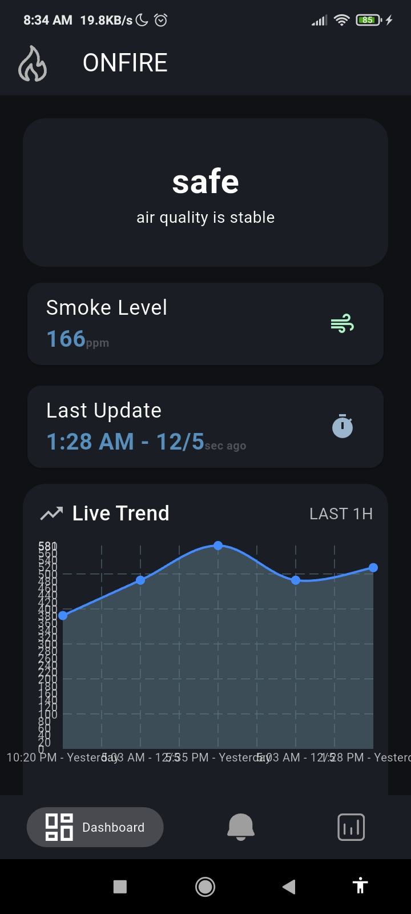
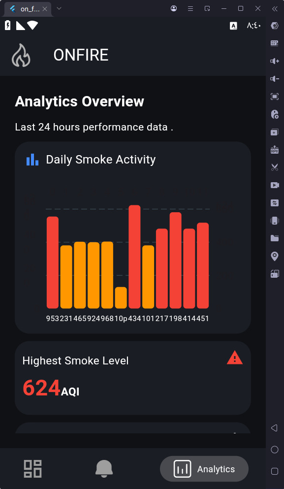
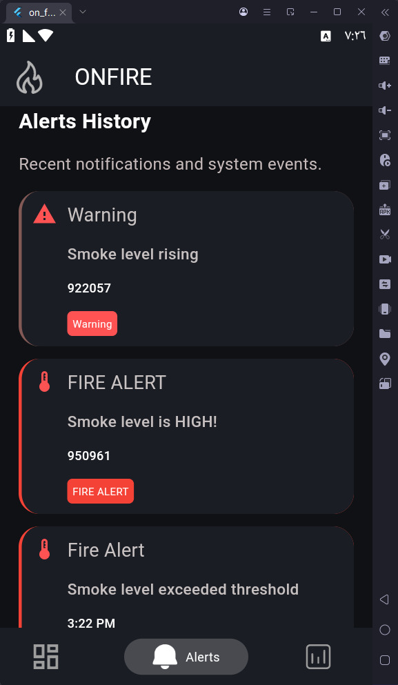

# 🔥 OnFire Project (Flutter + IoT)

A smart fire and gas detection system that connects IoT sensors with a Flutter mobile application for real-time monitoring, alerts, and analytics.

---

## 📌 Overview

OnFire Project is an IoT-based safety system designed to detect fire and gas leaks using hardware sensors and instantly notify users through a Flutter mobile application. The system uses Firebase Realtime Database to provide live synchronization of data and ensure fast emergency response.

The project follows Clean Architecture principles to ensure scalability, maintainability, and separation of concerns.

---

## ✨ Features

- 🔥 Real-time fire detection using IoT sensors  
- 🧪 Gas leakage detection system  
- 📲 Instant mobile alerts and notifications  
- 📡 Live data syncing using Firebase Realtime Database  
- 📊 Analytics dashboard with bar chart and line chart visualization  
- ⚡ Real-time monitoring of sensor states  
- 🧠 Clean Architecture implementation for scalable structure  

---

## 📸 App Screenshots

### 🔥 Splash & Icon

  
  

---

### 📊 Dashboard & Analytics

  
  

---

### 🚨 Alerts System

  

---
## 🧠 Architecture & Design Principles

This project was built using **Clean Architecture** to ensure scalability, maintainability, and separation of concerns across all layers of the application.

---

### 🏗️ Clean Architecture

The project is divided into three main layers:

- **Presentation Layer**
  - UI Screens (Flutter Widgets)
  - State Management (Cubit/Bloc)
  - Handles user interactions

- **Domain Layer**
  - Business Logic
  - Use Cases
  - Entities

- **Data Layer**
  - Repository Implementations
  - Firebase Realtime Database Integration
  - Data Sources (Remote / Local)

---

### ⚙️ SOLID Principles

The project follows SOLID principles to improve code quality and maintainability:

- **S** – Single Responsibility Principle (each class has one responsibility)
- **O** – Open/Closed Principle (code is open for extension, closed for modification)
- **L** – Liskov Substitution Principle (subtypes are replaceable)
- **I** – Interface Segregation Principle (small focused interfaces)
- **D** – Dependency Inversion Principle (depend on abstractions, not implementations)

---

### 🎨 Design Patterns Used

- Repository Pattern (for data abstraction)
- Singleton Pattern (for Firebase services)
- MVC/MVVM-inspired structure in presentation layer
- Dependency Injection (for managing services and decoupling modules)

---

### 🔥 Why This Architecture?

- Easy to scale for future features (AI, Web Dashboard, etc.)
- Clean separation between UI and business logic
- Easier testing and debugging
- Better maintainability for team collaboration
## 🛠️ Tech Stack

### Mobile App
- Flutter
- Dart

### Backend / Realtime Database
- Firebase Realtime Database
- Firebase Cloud Messaging (FCM)

### IoT Layer
- ESP32 / Arduino (or any compatible microcontroller)
- Fire sensor
- Gas sensor

### Data Visualization
- Bar Chart (Analytics)
- Line Chart (Trends over time)

---

## 🏗️ System Architecture

1. IoT sensors detect fire or gas leakage  
2. Microcontroller sends data to Firebase Realtime Database  
3. Flutter app listens to real-time updates from Firebase  
4. Alerts and notifications are triggered instantly  
5. Data is processed and visualized using charts (bar + line)  

---

## 📱 App Modules

- Home Dashboard  
- Live Monitoring Screen  
- Alerts & Notifications  
- Analytics Dashboard (Bar + Line Charts)  

---

## 🚀 Getting Started

### Prerequisites
- Flutter SDK installed  
- Firebase project configured  
- IoT hardware setup (ESP32/Arduino)

### Installation

git clone https://github.com/Basmala-hub/on-fire-project.git  
cd on-fire-project  
flutter pub get  

---

## 🔥 Firebase Setup

1. Create Firebase project  
2. Enable Realtime Database  
3. Add Android/iOS apps  
4. Download configuration files:
   - google-services.json (Android)  
   - GoogleService-Info.plist (iOS)  
5. Place them in correct platform folders  

---

## 📊 Future Improvements

- AI-based fire prediction system  
- Camera integration for verification  
- SMS emergency alerts  
- Multi-building monitoring system  
- Web dashboard using React  

---

## 👩‍💻 Developer

Basmala Said  
Flutter Developer | IoT Enthusiast  

---

## 📄 License

This project is for educational purposes only.